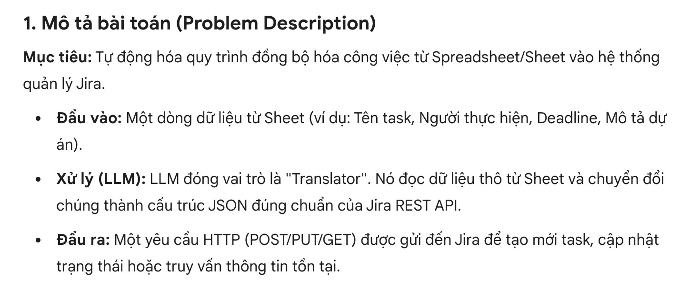
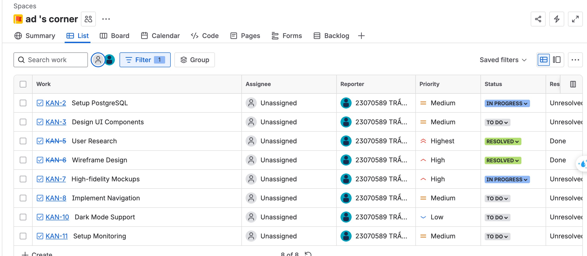
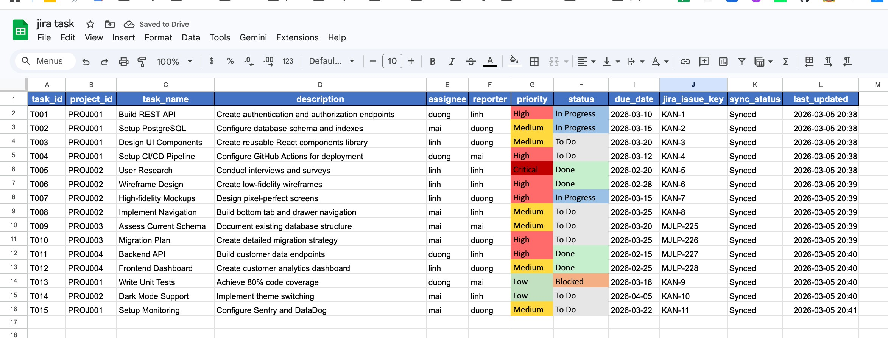

# Jira ↔ Google Sheets Sync + AI Agent

Hệ thống tự động sync tasks giữa Google Sheets và Jira Cloud, tích hợp Gemini AI để query và quản lý tasks bằng ngôn ngữ tự nhiên.

## Link 1: Sheet

**Google Sheet:** [Jira Integration Sheet](https://docs.google.com/spreadsheets/d/1IMWZ3POaPCHt2GqaO7QtRMLKCpcPcTXEO1Q2WwH-uZY/edit?gid=34214529#gid=34214529)
## Link 2: jira

 **Google Sheet:** [Jira ](https://ad-corner.atlassian.net/jira/software/projects/KAN/list?jql=project%20%3D%20KAN%20AND%20assignee%20%3D%20EMPTY%20ORDER%20BY%20cf%5B10019%5D%20ASC)


### Chat Interface


### Result


### Jira Board


### Google Sheet


## Features

### Bi-directional Sync
- Sync tasks từ Google Sheets sang Jira Cloud
- Tự động map các field: assignee, reporter, priority, status
- Smart status transitions (tự detect workflow của từng Jira project)
- Tạo issue mới hoặc update issue có sẵn

### AI Assistant với Function Calling
- Dùng Gemini 2.5 Flash với automatic function calling
- Query bằng câu tự nhiên: "Show me all tasks assigned to duong"
- Tạo/update Jira issues qua conversation
- Query projects, tasks, team members, sync logs

**Cách LLM generate JSON để query/update data:**

System define Python functions với typed parameters và docstrings trong [src/agents/llm_agent.py](src/agents/llm_agent.py):

```python
def list_tasks(
    project_id: str = "",
    assignee: str = "",
    status: str = "",
    priority: str = "",
) -> str:
    """List tasks with optional filters.
    
    Args:
        project_id: Filter by project ID (e.g. PROJ001).
        assignee: Filter by assignee name.
        status: Filter by status (To Do, In Progress, Done).
        priority: Filter by priority (High, Medium, Low).
    """
    return json.dumps(result)
```

Khi bạn hỏi "Show tasks assigned to duong with high priority", Gemini sẽ:

1. Parse intent của bạn, biết cần gọi `list_tasks()`
2. Generate function call JSON:
   ```json
   {
     "name": "list_tasks",
     "arguments": {
       "assignee": "duong",
       "priority": "High"
     }
   }
   ```
3. SDK execute Python function với arguments đó
4. Return result dạng JSON, Gemini format thành natural language

**10 tool functions available:**

```python
TOOLS = [
    list_all_projects,
    list_tasks,
    get_task_detail,
    get_team_members,
    get_project_summary,
    get_sync_log,
    search_jira_issues,
    create_jira_issue,
    update_jira_issue,
    get_jira_issue_detail,
]
```

Không cần viết JSON thủ công. Describe what you want bằng tiếng Việt/Anh bình thường, Gemini tự handle function selection và argument generation qua `google-genai` SDK.

### Reporting & Analytics
- Real-time dashboard với task statistics
- Team workload analysis
- Track overdue tasks
- Sync log history
- Export reports dạng JSON

### Smart Field Resolution
- Auto-lookup Jira account IDs theo name
- Priority normalization (Critical → Highest, etc.)
- Status mapping cho different Jira workflows
- Handle missing/invalid data gracefully

---

## Quick Start

### Prerequisites

- Python 3.10+
- Google Cloud service account cho Sheets API
- Jira Cloud account + API token
- Google AI Studio API key

### 1. Install Dependencies

```bash
python -m venv .venv
source .venv/bin/activate
pip install -r requirements.txt
```

### 2. Configure Environment

Copy `.env.example` thành `.env` và điền credentials:

```bash
cp .env.example .env
```

**Required credentials:**

```env
JIRA_URL=https://your-domain.atlassian.net
JIRA_EMAIL=your-email@example.com
JIRA_API_TOKEN=your_jira_api_token

GOOGLE_SHEET_ID=your_google_sheet_id
GOOGLE_SERVICE_ACCOUNT_FILE=./service_account.json

GOOGLE_API_KEY=your_gemini_api_key
```

### 3. Setup Google Sheets API

1. Tạo project trong Google Cloud Console
2. Enable Google Sheets API và Google Drive API
3. Tạo Service Account, download `service_account.json`
4. Share Google Sheet của bạn với service account email (quyền Editor)

### 4. Get Jira API Token

1. Vào Atlassian API Tokens
2. Create token, copy vào `.env`

### 5. Get Gemini API Key

1. Visit Google AI Studio
2. Create API key, copy vào `.env`

---

## Usage

### Sync Tasks to Jira

```bash
python main.py sync
```

Cái này sẽ:
- Đọc tất cả tasks có `sync_status = "Pending"` từ Google Sheet
- Tạo mới Jira issues nếu chưa có `jira_issue_key`, hoặc update nếu đã có
- Sync các field: summary, description, assignee, reporter, priority, status, due date
- Write back Jira issue keys và sync status vào sheet
- Append entries vào Sync Log

Output:
```
[CREATE] T001 → KAN-1: Issue KAN-1 created successfully
[UPDATE] T002 → KAN-2: Issue KAN-2 updated successfully
Synced 15/15 tasks.
```

---

### View Dashboard

```bash
python main.py dashboard
```

Show:
- Total projects, tasks, pending sync count
- Task counts by status
- Projects table với completion stats

---

### Full Analytics Report

```bash
python main.py report
```

Display:
- Dashboard summary
- All projects table
- All tasks table
- Team workload analysis
- Overdue tasks nếu có
- Recent sync log

---

### Chat với AI Agent

```bash
python main.py chat
```

**Example queries:**

```
You: Show me all tasks assigned to duong

You: What's the status of T001?

You: Create a new task "Fix login bug" in project KAN, high priority, assign to mai

You: Update KAN-5 to "In Progress" and add comment "Working on this"

You: Show me overdue tasks
```

**Special commands:**
- `/reset` - Clear conversation history
- `quit` hoặc `exit` - Exit chat

---

### Other Commands

| Command | Description |
|---------|-------------|
| `python main.py tasks` | Show all tasks table |
| `python main.py overdue` | Show overdue tasks only |
| `python main.py team` | Show team workload breakdown |
| `python main.py logs` | Show sync log history |
| `python main.py export -o report.json` | Export report as JSON |

---

## Project Structure

```
jira/
├── main.py                    # CLI entry point
├── .env                       # Environment config (credentials)
├── service_account.json       # Google service account key
├── requirements.txt           # Python dependencies
│
├── src/                       # Source code
│   ├── core/                  # Core business logic
│   │   ├── jira_client.py    # Jira REST API wrapper
│   │   ├── sheet_reader.py   # Google Sheets I/O
│   │   ├── sync_service.py   # Sync orchestration logic
│   │   └── reporting.py      # Analytics & terminal tables
│   │
│   ├── agents/                # AI agents
│   │   └── llm_agent.py      # Gemini agent with function calling
│   │
│   └── utils/                 # Utilities
│       └── config.py          # Environment config loader
│
├── scripts/                   # Utility scripts
│   ├── _check.py             # Check sheet data
│   ├── _fix_sheet.py         # Fix sheet formatting
│   └── _reset_pending.py     # Reset sync status
│
├── docs/                      # Documentation
│   └── problem.md            # Problem statement
│
└── images/                    # Demo images
    ├── image.png             # Chat interface
    ├── demo.jpg              # Result screenshot
    ├── jira.jpg              # Jira board
    └── sheet.jpg             # Google Sheet
```

**Module roles:**
- `main.py` - CLI entry point với command routing
- `src/core/` - Core business logic (Jira, Sheets, Sync, Reporting)
- `src/agents/` - AI agent implementations
- `src/utils/` - Configuration và helper functions
- `scripts/` - Maintenance và debugging tools

---

## Architecture

### Data Flow

```
Google Sheet (Tasks với sync_status="Pending")
    ↓
src/core/sheet_reader.py: load_sheet() → Task objects
    ↓
src/core/sync_service.py: sync_task_to_jira()
    ├─ Resolve assignee/reporter via Jira API
    ├─ Normalize priority (Critical → Highest)
    ├─ Map status (Done → Resolved/Done based on workflow)
    └─ src/core/jira_client.py: create_issue() hoặc update_issue()
    ↓
Write back: jira_issue_key, sync_status="Synced"
    ↓
Append to Sync Log sheet
```

### LLM Agent Flow

```
User: "Show me all tasks assigned to duong"
    ↓
Gemini 2.5 Flash (with function calling)
    ↓
Decides to call: list_tasks(assignee="duong")
    ↓
SDK executes Python function → returns JSON
    ↓
Gemini formats response → returns markdown table
```

---

## Google Sheet Structure

Sheet của bạn phải có các tabs này:

### 1. Projects
| project_id | project_name | jira_project_key | owner | start_date | end_date | status | description |
|------------|--------------|------------------|-------|------------|----------|--------|-------------|
| PROJ001 | AI Task Manager | KAN | duong | 2026-03-01 | 2026-06-30 | Active | ... |

### 2. Tasks
| task_id | project_id | task_name | description | assignee | reporter | priority | status | due_date | jira_issue_key | sync_status | last_updated |
|---------|------------|-----------|-------------|----------|----------|----------|--------|----------|----------------|-------------|--------------|
| T001 | PROJ001 | Build REST API | ... | duong | mai | High | In Progress | 2026-03-15 | KAN-1 | Synced | 2026-03-05 10:30 |

### 3. Team Members
| user_id | name | email | jira_account_id | role |
|---------|------|-------|-----------------|------|
| U001 | duong | duong@example.com | (auto-resolved) | Tech Lead |

### 4. Sync Log
| log_id | task_id | action | jira_issue | status | message | timestamp |
|--------|---------|--------|------------|--------|---------|-----------|
| L001 | T001 | create | KAN-1 | success | Issue created successfully | 2026-03-05 09:15 |

### 5. Task Updates (optional)
Track field changes over time.

---

## Configuration Details

### Priority Mapping

| Sheet Priority | Jira Priority |
|---------------|---------------|
| Critical | Highest |
| High | High |
| Medium | Medium |
| Low | Low |

### Status Mapping

Handle different Jira workflows:

| Sheet Status | KAN Project | MJLP Project |
|--------------|-------------|--------------|
| To Do | To Do | To Do |
| In Progress | In Progress | In Progress |
| Done | Resolved | Done |
| Blocked | Waiting | (not available) |

Sync engine sẽ try cả mapped name và original name.

---

## AI Agent Tools

Gemini agent có access đến 10 tools:

### Query Tools
- `list_all_projects()` - List all projects
- `list_tasks(...)` - Filter tasks by project/assignee/status/priority
- `get_task_detail(task_id)` - Full details của 1 task
- `get_team_members()` - List team với roles
- `get_project_summary()` - Stats: counts by status, overdue, etc.
- `get_sync_log(task_id?)` - Sync history
- `search_jira_issues(jql)` - JQL query against Jira API

### Write Tools
- `create_jira_issue(...)` - Create new issue
- `update_jira_issue(...)` - Update fields, transition status, add comment
- `get_jira_issue_detail(issue_key)` - Fetch from Jira API

All tools return JSON, Gemini formats thành natural language.

---

## Troubleshooting

### Sync fails với "assignee not valid"
System auto-resolve assignee by name lookup trong Jira. Nếu lookup fail, issue sẽ được tạo unassigned. Make sure team member names trong sheet match với Jira display names.

### Status transition fails
Different Jira projects có different workflows. Check available transitions: error message sẽ show valid options. Update `STATUS_MAP` trong [src/core/jira_client.py](src/core/jira_client.py) nếu cần.

### Google Sheets authentication error
- Verify `service_account.json` valid
- Share sheet với service account email
- Enable cả Sheets API và Drive API trong Google Cloud Console

### Gemini API rate limits
Free tier: 15 requests/minute. Nếu hit limits, wait 60 seconds hoặc upgrade to paid tier. Chat mode gửi 1 request per user message (function calls count as 1).

---

## Development

### Run tests

```bash
python -m src.core.sheet_reader
python -m src.core.jira_client
python -m src.core.sync_service
```

### Enable debug logging

```bash
python main.py sync -v
```

---

## Dependencies

- gspread (6.2.1) - Google Sheets API
- google-auth (2.48.0) - OAuth for Google services
- google-genai (1.66.0) - Gemini AI with function calling
- requests (2.32.3) - HTTP client for Jira REST API
- rich (14.3.3) - Terminal UI & markdown rendering
- tabulate (0.9.0) - Pretty tables
- python-dotenv (1.0.1) - Environment config

---

## License

MIT

---

## Tips

- Batch sync: Reset all tasks to "Pending" để re-sync everything (`python scripts/_reset_pending.py`)
- Dry-run mode: Remove Jira credentials để test sync logic without creating issues
- Chat agent: Works offline với local sheet data nếu Jira credentials missing
- Custom fields: Extend `Task` dataclass trong [src/core/sheet_reader.py](src/core/sheet_reader.py) để add more fields
- Webhooks: Add Flask endpoint để receive Jira webhooks for real-time updates
# jira-auto
